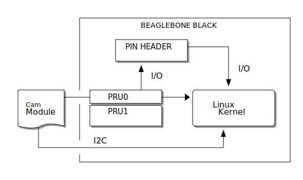

## Booting Linux on BeagleBone Black in less than 3 seconds

The main purpose of this work is to optimize the Linux kernel boot time, measured
using an Arduino Nano 33 BLE board driving an alphanumeric LCD display via I2C.

IMPORTANT: This is work in progress!

### Hardware setup

#### Overview

- Communication



#### Camera module

- Signals


### Building sources

- Commands

```shell
$ make O=/path/to/custom/output/dir config
$ cd /path/to/custom/output/dir
$ make
```
