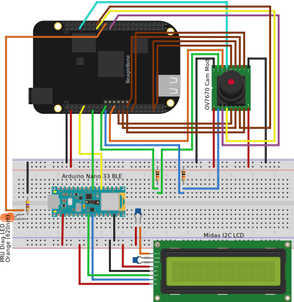

## Booting Linux on BeagleBone Black in less than 1.5 seconds

The main purpose of this work is to optimize the boot time of the mainline
Linux kernel, which is measured using an Arduino Nano 33 BLE board driving an
alphanumeric LCD display via I2C.

IMPORTANT: This is work in progress!

### System architecture

#### Overview


#### Breadboard prototype



#### Camera module


### Building sources

```shell
$ make O=/path/to/custom/output/dir PRJ_PROFILE=prod prepare
$ cd /path/to/custom/output/dir
$ make
```

### Deployment and testing

- Prepare uSD card

```shell
$ tools/prepare-sd-card.sh binaries/sd-card.img
```


- Boot SBC and stop at the U-Boot prompt

```shell
U-Boot 2021.01 (Jul 23 2021 - 13:41:15 +0000)
[...]
Hit any key to stop autoboot:  0
=>
```

- Enable U-Boot Falcon mode

```shell
=> load mmc 0:1 ${loadaddr} uEnv-falcon.txt
=> env import -t ${loadaddr} ${filesize}
=> run enable_falcon
=> reset
```
